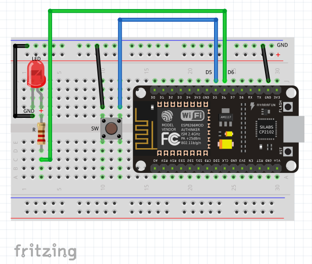

# IoT-Lab: Hardware setup
We are now ready to build our ordering button device and develop our first program ("sketch") for it.

To quickly wire everything up, we use a [Breadboard](Breadboard.md). The breadboard allows to set up temporary circuits and change them quickly.

<!-- MDTOC maxdepth:6 firsth1:1 numbering:0 flatten:0 bullets:1 updateOnSave:1 -->

- [IoT-Lab: Hardware setup and first test](#iot-lab-hardware-setup-and-first-test)   
   - [List of parts](#list-of-parts)   
   - [Wiring diagram](#wiring-diagram)   
      - [Notes](#notes)   

<!-- /MDTOC -->

## List of parts
The ordering button device just needs a handful of components:
  * a [Breadboard](Breadboard.md) for mounting components
  * the [NodeMCU](https://en.wikipedia.org/wiki/NodeMCU) prototyping board with ESP8266 micro controller [compatible](http://frightanic.com/iot/comparison-of-esp8266-nodemcu-development-boards/) with the breadboard
  * a switch/push button (SW)
  * a [LED](https://en.wikipedia.org/wiki/Light-emitting_diode) and [resistor](https://en.wikipedia.org/wiki/Resistor) (R)
  * some cables for patching the components together

## Wiring diagram
Before we start, some security precautions:
  * disconnect the NodeMCU from the USB cable whenver you are going to change the circuit
  * don't forget the resistors when connecting an LED to the board -- otherwise the hardware may be damaged!

### Notes
  * a LED has a polarity. The longer of the two legs must be connected to positive voltage (+), the other one to ground ([GND](https://en.wikipedia.org/wiki/Ground_(electricity)))
  * double check your circuit before proceeding with the firmware development.

---
Next: [set up the firmware for the ordering button](Firmware_Development.md)
