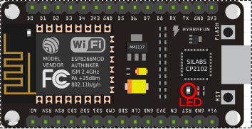

# IoT-Lab: *Hello, world!*
Now that everything is set up, it's time for a first test. We will run our first sketch: the embedded version of the famous "Hello, world!". Will let the builtin LED of the NodeMCU board blink.



## What is a sketch?
A `sketch` is a program (firmware) for an Arduino or similar micro controller. Sketches are written using the Arduino IDE.

### Anatomy of a sketch
A sketch is written in C++ and has always the same structure, consisting of
  * a `setup()` function, which is called once, when the sketch starts, and
  * a `loop()` function, which is run over and over again, and executing the main program logic.

``` c++
void setup() {
  /* put one-time initializations here */
}

void loop() {
  /* this function is run over and over again */
}

```

## `Hello, world!` Instructions
  * connect the NodeMCU with the USB cable to your computer
  * start the Arduino-IDE
  * make sure that under `Tools > Board` the `NodeMCU 1.0 (ESP-12E Module)` board is selected
  * make sure that under `Tools > Port` the right port is selected (e.g. `/dev/ttyUSB0` or `COM4`)
  * enter or copy the `Hello, World!` sketch from below into the editor window
  * click the `Upload` button. This will compile the sketch and on success upload it to the board.
  * on success, the builtin LED of the board will start to blink. Note that the code is executed by the micro controller. Once the sketch development is done and the firmware is uploaded to the micro controller, the host PC is no longer needed (provided that the micro controller is connected to a power supply).

## The `Hello, world!` sketch
Copy the following code into the the Arduino IDE and select "Verify/Compile" from the Sketch Menu.

``` c++
/*
 * "Hello, world!" - embedded version.
 * let the built-in LED of the NodeMCU board blink
 */
#include <pins_arduino.h>

const int LED_PIN = BUILTIN_LED;

void setup() {
    pinMode(LED_PIN, OUTPUT);
}

void loop() {
  digitalWrite(LED_PIN, LOW);
  delay(500);
  digitalWrite(LED_PIN, HIGH);
  delay(500);
}
```
***
Next: We made sure that everything is up and running. [Now set up the hardware for the ordering button.](Hardware_Setup.md)
