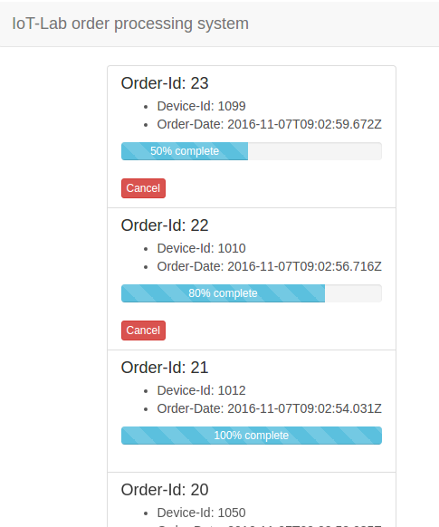

# IoT-Lab: testing the device

1. **turn on/reset the device**
2. **the device first tries to establish a WiFi connection**. While connecting, the built-in LED blinks in 0.5s intervals. After successful connection, the LED is turned off.
2. **press the button to send a new order** to back end.
    * **the LED should flash for 0.5s**. This is a feedback from the device, that button-press was recognized and will be processed
    * **if there is no other order for the device** currently beeing processed, you should now see the new order coming up in the lab-provided *order processing system* web application (back end)
      * after the order is processed (virtually), the back end sends a positive acknowledgement to the device
      * the device flashes the LED for 2s to give the user feedback  that the order was successfully processed.
    * **if however there is already an order** being processed for the device, than no new order object will be created in the back end.
      * in this case the back end sends a negative acknowledgement to the device
      * the device notifies the user with a quick blinking sequence of the LED that the order was not processed.

## The order processing system
The lab provides a micro service to view the status of the orders in real time.



## Debugging
To debug the firmware, we can use the `serial monitor` of the Arduino-IDE. The serial monitor allows displaying output generated with the print-methods of the `Serial` class in a sketch.

``` c++
/*
 * example usage of Serial class for Debugging
 */
void setup() {
  // speed of serial port must be set
  Serial.begin(9600);
  // print some text
  Serial.println("entering setup.");
}
...
```
